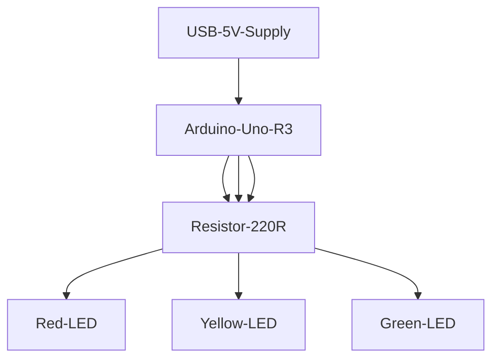

# Circuit Diagram

Generated from output.json

```mermaid
graph TD
    USB-5V-Supply --> Arduino-Uno-R3
    Arduino-Uno-R3 --> Resistor-220R
    Resistor-220R --> Red-LED
    Arduino-Uno-R3 --> Resistor-220R
    Resistor-220R --> Yellow-LED
    Arduino-Uno-R3 --> Resistor-220R
    Resistor-220R --> Green-LED
```

---
_Paste the mermaid block at https://mermaid.live to view the diagram!_
